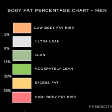
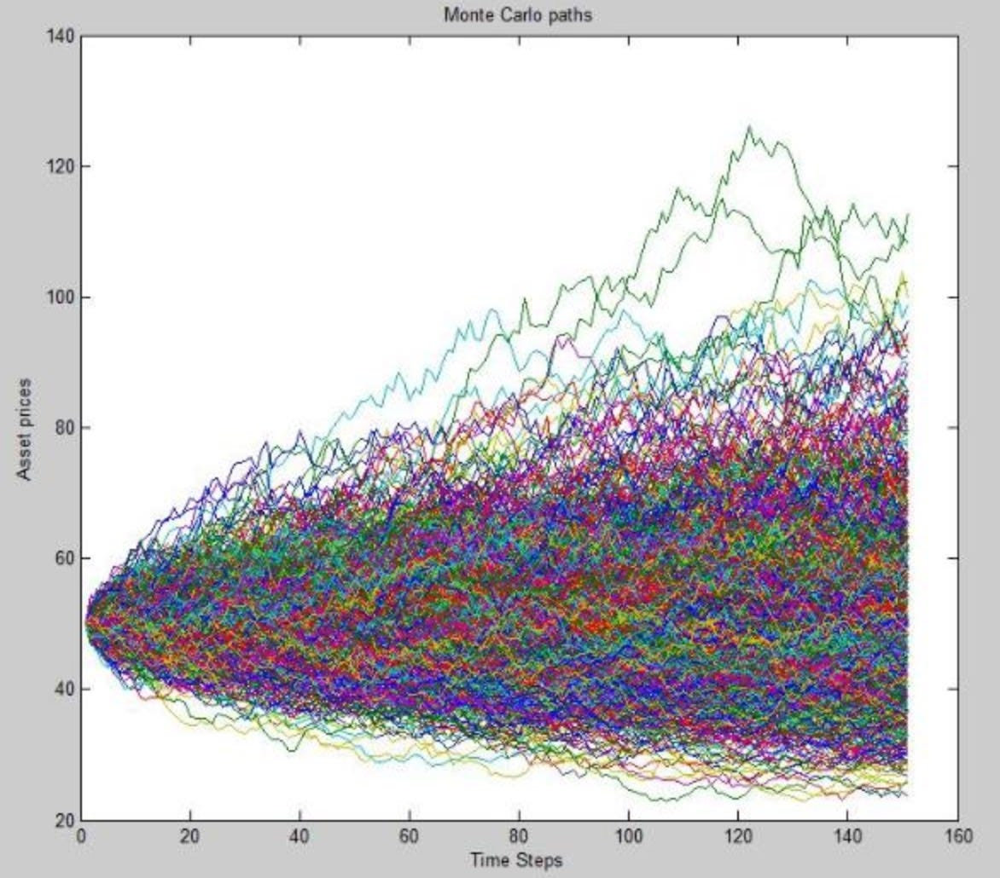

## [Project1: Regression Analysis of Housing Prices](https://github.com/dsrichard97/Project1_RegressionSTAT510)
* Collaborators: Luis Osorio, Richard DiazDeLeon, Victor Chen
* Date: September 5, 2023

## [Project2: Analyzing Health and Nutritional Status in the United States](https://github.com/dsrichard97/Project4_MLgenomicsdata.git)
* Collaborators: Richard Diazdeleon (In Progress)
* Date: TBD 

## [Project3: Monte Carlo Simulation - NVDA and ASML](https://github.com/dsrichard97/project3_montecarlosim)
* Collaborators: Richard Diazdeleon
* Date: September 23,2023 

# Project4: Dynamic Hotel Pricing and Customer Segmentation using Machine Learning
* Collaborators: Richard Diazdeleon
* Date: October 5,2023 

